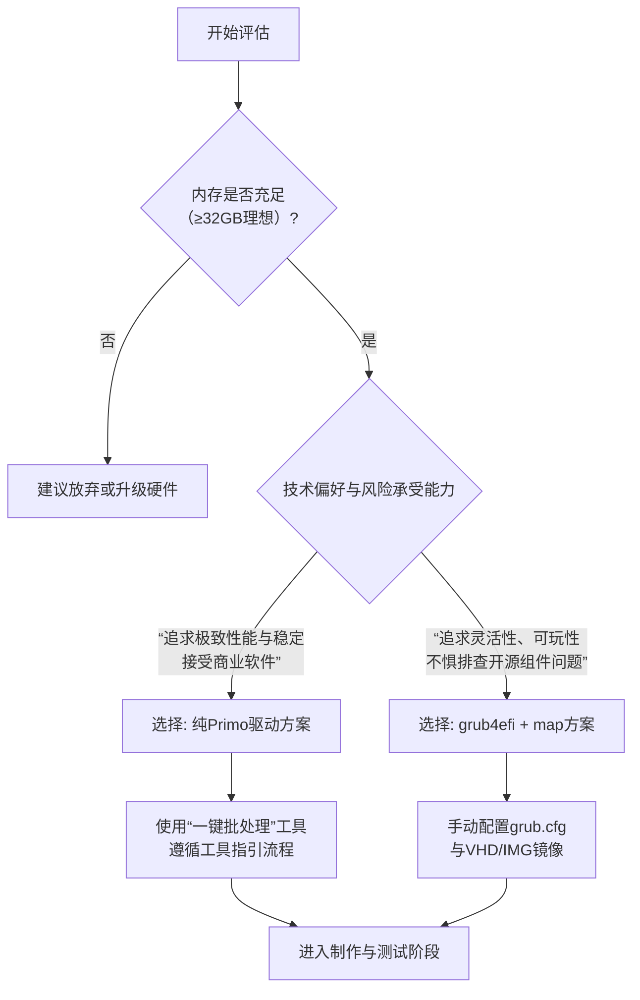
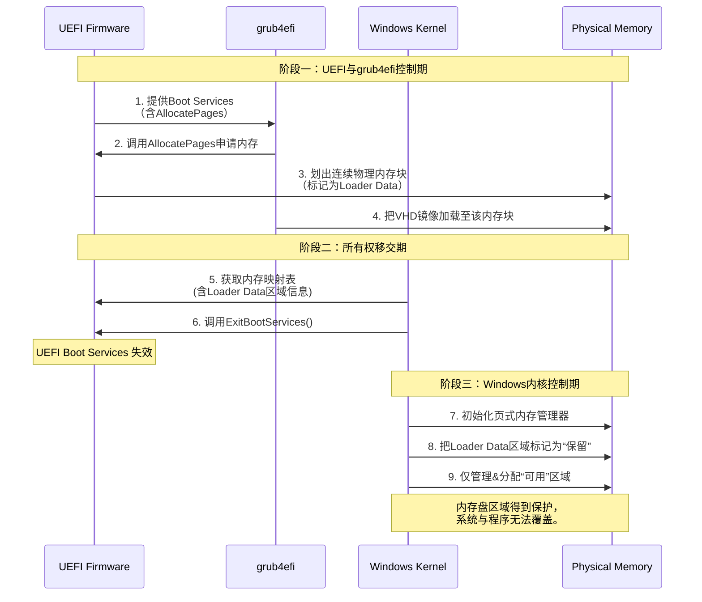

# 叫大模型简短总结下.
细致讲解RAMOS这套技术的原理之每个细节.   
第二, 从头到尾, 具体流程也要列出, 要考虑可能的突发情况该如何处理.   
用工程思维讲述, 不要轻飘飘.   
注意简短精炼描述.   


# 深求的回答.

### **RAMOS核心技术原理拆解**

**核心目标**：把操作系统从低速块设备（硬盘）移入高速字节寻址介质（内存）中运行，实现性能质变。

**技术栈蓝图**：
```
物理硬件 -> 引导程序 -> 内存虚拟块设备 -> Windows 内核与驱动 -> 用户系统
         (grub4efi/P驱引导)  (关键：如何创建)            (关键：如何接管)
```

#### **1. 核心原理：内存虚拟块设备的创建与接管**
RAMOS不是“运行在内存中”，而是“运行在一个**由内存模拟的、被系统识别为磁盘的块设备**”中。全部技术差异均源于创建此设备的方式和时机。

*   **路径A：grub4efi + map --mem + ntloader（文件映射式）**
    *   **创建时机**：**引导阶段**。由GRUB2及其`map --mem`命令，在Windows启动前，把硬盘上的VHD/IMG文件**线性加载**到一段连续的物理内存区域，并将其 BIOS/ UEFI 中断调用形式“宣告”为一块硬盘。
    *   **接管过程**：
        1.  `ntloader`模块引导Windows Boot Manager (`bootmgfw.efi`)。
        2.  Windows启动管理器加载其`winload.efi`。
        3.  `winload.efi`加载内核 (`ntoskrnl.exe`) 和驱动，此时系统仍以为自己在物理硬盘上。
        4.  内核初始化完成后，**全部磁盘I/O请求被直接导向由`map`建立的内存区域**，物理硬盘进入休眠状态。
    *   **本质**：在引导层面完成“**磁盘置换**”。

*   **路径B：纯Primo驱动RAMOS（驱动过滤式）**
    *   **创建时机**：**系统启动中期**。初始阶段，Windows从物理硬盘（或小镜像）正常启动。
    *   **接管过程**：
        1.  Windows内核加载并初始化包括`primo.sys`在内的各类驱动。
        2.  `primo.sys`驱动根据预设配置，**在内存中创建一个空的、未格式化的虚拟磁盘**。
        3.  该驱动通过**文件系统过滤层**或**卷管理技术**，把已启动的系统全部磁盘I/O操作，**实时、透明地重定向**到内存虚拟盘。
        4.  同时，系统状态（注册表、内存中的文件结构）被“锁定”在此内存盘中，原物理硬盘可被卸载。
    *   **本质**：在驱动层面完成“**I/O重定向**”。

#### **2. 关键细节与指标差异根源**
*   **内存占用**：`map --mem`需**预先连续占用**等同于镜像文件大小的内存。Primo驱动可采用**稀疏指针+内存压缩**，实现按需占用与动态回收，内存利用率更高。
*   **性能**：两者连续读写均达内存带宽上限。但**4K随机读写**（决定系统“跟手度”）受I/O路径长度影响：
    *   `map`路径：需经过 `VHD文件层` -> `map虚拟层` -> `NTFS文件系统`。
    *   `P驱`路径：多在`primo.sys`驱动内核态内完成，路径更短，延迟更低。
*   **兼容性与稳定性**：
    *   `map`方案依赖`UEFI`内存映射服务的质量与`ntloader`的适配，硬件兼容性链更长。
    *   `P驱`方案依赖Windows内核本身的稳定性，其驱动已通过微软WHQL认证，在主流硬件上更可控。

### **工程化实施流程与应急预案**

#### **阶段一：环境评估与准备**
1.  **硬件核查**：
    *   **内存**：总容量 ≥ （系统盘已用空间 × 1.5 + 日常富裕量）。例：C盘已用20GB，内存建议32GB以上。
    *   **主板**：记录型号，在无忧启动论坛搜索成功案例。**关闭Secure Boot**。
2.  **软件准备**：
    *   **路径选择**：根据评估（图1决策树）选定技术路线。
    *   **工具集**：
        *   通用：`DiskGenius`、 `DISM++`、 `BootICE`。
        *   `map`方案：最新版 `grub4efi`、 `ntloader`。
        *   `P驱`方案：`Primo Ramdisk`服务器版、对应 `Ramos一键批处理多合一`工具。
    *   **系统源**：准备干净、精简的Windows安装镜像（WIM/ESD格式）。



#### **阶段二：系统镜像制作（核心工厂环节）**
1.  **在内存盘中创建并安装系统**：
    *   使用 `Primo Ramdisk` 或 `ImDisk` 创建一个**临时内存盘（R:）**。
    *   在此盘内创建**固定大小VHD**，挂载为V盘。
    *   使用 `DISM`把系统镜像应用到V盘，并用 `bcdboot`建立引导。
    *   **突发处理**：若应用失败，检查镜像索引号是否正确，或使用 `DISM++`图形化操作。
2.  **离线注入与优化**：
    *   使用 `DISM++`挂载V盘系统，**注入全部必需驱动**（重点是磁盘控制器、网卡）。
    *   进行系统精简（禁用页面文件、休眠等）。
    *   **突发处理**：驱动冲突可能导致目标系统蓝屏。优先注入仅磁盘控制器和网卡驱动，其余可进入系统后补装。
3.  **封装与转移**：
    *   卸载VHD，此时 `R:\system.vhd` 为完整镜像。
    *   把此VHD文件**一次性拷贝**至SSD目标目录（如 `D:\RAMOS\`）。此为唯一大量写SSD操作。

#### **阶段三：引导配置（最脆弱环节）**
1.  **路径A（map方案）**：
    *   挂载ESP分区，放置 `grubx64.efi`、`ntloader`、`initrd.lz4`等文件。
    *   编辑 `grub.cfg`，核心命令：`map --mem --top (hd0,gptX)/ramos/system.vhd (hd0)` 后接 `chainloader /efi/.../bootmgfw.efi`。
    *   使用 `BOOTICE` 添加UEFI引导序列指向 `grubx64.efi`。
    *   **突发处理1（黑屏）**：`map`失败。尝试添加 `--top`参数，或把VHD文件移至硬盘首个分区。
    *   **突发处理2（报错0xc000007b）**：`ntloader`与系统版本不匹配，替换为对应版本。
2.  **路径B（P驱方案）**：
    *   以管理员身份运行“一键批处理”工具。
    *   根据提示选择模式（如 `3. COMPACT RAMOS`）、镜像大小、盘符。
    *   工具将自动安装P驱、创建镜像、复制系统、配置引导。
    *   **突发处理（制作失败）**：重启宿主机，以 **“安全模式”** 运行一键工具。失败日志通常在工具目录下的 `.log`文件中。

#### **阶段四：测试与迭代**
1.  **首次启动**：选择RAMOS启动项。
2.  **成功标志**：进入桌面后，使用 `CrystalDiskMark` 或 `AS SSD` 测试系统盘（C盘）速度，应显示为 **“内存速度”** （读取>5GB/s）。
3.  **失败诊断**：
    *   **蓝屏（INACCESSIBLE_BOOT_DEVICE）**：磁盘控制器驱动缺失。回阶段二，用 `DISM++`补打驱动。
    *   **反复重启**：引导文件配置错误。在宿主机用 `BootICE`检查 `BCD`文件中的 `device`和 `osdevice`路径。
    *   **性能不达预期**：检查是否成功运行于内存盘。确认 `P驱`方案中，`Primo Ramdisk`控制台里虚拟盘状态为“已连接”。
4.  **热备份验证**：安装一个测试软件，使用方案对应的热备份功能重启。检查软件是否被保留，验证持久化流程。

**最终工程原则**：**一次只变动一个变量**。制作失败后，回退到上一个稳定状态（如可启动的VHD）进行差分调试，而非推倒重来。全部操作先在虚拟机中预演，再应用于物理机。


# 问
详细寻找从裸机引导阶段的grub4efi及其工具链, 从哪里下载, 怎么操作, 放入哪里.
其引导文件的配置参数, 特别重要, 要深度搜索 `无忧论坛` , 去找跟grub4efi相关的参数怎么写, 最好列出grub4efi的全部参数与选型, 细致讲解.
顺便找找无忧论坛里跟grub4efi这一路径相关的RAMOS技术有哪些坑是别人踩过的.

# 答

根据你的需求，我们深入到`grub4efi`引导RAMOS的工程细节，从获取工具到编写启动菜单，再到避坑指南，以下是详细的操作指南。

### 🛠️ 核心工具链：获取与部署
实现`grub4efi + map --mem + ntloader`方案，你需要以下核心文件，均可在 **grub4dos** 的官方发布页面获取。下表中列出的是**关键模块**：

| 模块/文件 | 作用与说明 | 存放位置建议 (以ESP分区为例) |
| :--- | :--- | :--- |
| **`grub4dos-for_UEFI-*.7z`** | **主引导器**。解压后找到 `bootx64.efi` (也可能是 `grubx64.efi`)，这是UEFI固件要加载的**核心文件**。 | `\EFI\grub\` |
| **`ntloader`** | **Windows加载器**。用于正确引导从内存盘映射出来的Windows系统，是启动成功的关键。 | `\EFI\grub\` 或其子目录 |
| **`initrd.lz1` (或类似)** | **初始内存盘文件**。通常与`ntloader`配合使用，为Windows启动初期提供必要的文件系统驱动等环境。 | 与 `ntloader` 同一目录 |
| **`menu.lst`** | **引导菜单配置文件**。由你**自行创建**的纯文本文件，定义了`map --mem`等全部启动逻辑。 | 通常与`.efi`文件同目录 |

**部署步骤**：
1.  从官网下载最新的 `grub4dos-for_UEFI-*.7z` 压缩包并解压。
2.  在你的**ESP分区**（或任何计划用于引导的分区）下，创建一个目录，例如 `\EFI\grub\`。
3.  把解压得到的 `.efi` 文件（通常需**改名为** `bootx64.efi` 以兼容UEFI默认引导）、`ntloader`、`initrd.lz1`等模块文件拷贝到此目录。
4.  在同一目录下，用记事本等工具创建并编辑 `menu.lst` 配置文件。

### ⚙️ 配置文件 (`menu.lst`) 核心参数解析
以下是用于启动VHD RAMOS的 `menu.lst` 核心配置示例与逐行解析：

```bash
title 启动 Windows RAMOS (VHD)
# 1. 定位并加载NTFS文件系统驱动（如果你的VHD放在NTFS分区）
find --ignore-floppies --ignore-cd /EFI/grub/ntfs_x64.efi && load /EFI/grub/ntfs_x64.efi
# 2. 查找VHD文件所在分区并设为根设备
find --ignore-floppies --ignore-cd --set-root /RAMOS/Win10.vhd
# 3. 【核心】把VHD文件完整加载到内存高端区域，并映射为硬盘
map --mem --top /RAMOS/Win10.vhd (hd)
# 4. 立即启用上一步创建的虚拟磁盘映射
map --hook
# 5. 【关键】使用ntloader引导，传递虚拟磁盘的UUID和initrd路径
uuid (hd-1,0)
chainloader /EFI/grub/ntloader uuid=%?_UUID% initrd=/EFI/grub/initrd.lz1
```
**关键参数深度解析**：
*   **`map --mem --top [file] (hd)`**：这是**内存加载的核心命令**。
    *   `--mem`：把指定文件**完整读入内存**，后续全部操作在内存中进行。
    *   `--top`：**至关重要**。尝试把内存盘分配在**高位内存**，以避免与后续Windows系统所需的内存空间冲突。如果启动失败，尝试**移除或增加此参数**是首要调试步骤。
    *   `(hd)`：把文件映射为**第一块硬盘**（虚拟的）。启动后，Windows会把它识别为启动盘（通常是C盘）。
*   **`chainloader` 与 `ntloader` 参数**：这是UEFI下引导Windows内存盘的关键，与BIOS时代不同。
    *   `uuid=%?_UUID%`：传递虚拟磁盘的UUID给`ntloader`，确保其能找到正确的启动分区。
    *   `initrd=/EFI/grub/initrd.lz1`：指定初始内存盘文件路径，为Windows启动提供支持。
*   **`find --set-root`**：自动搜索包含指定文件的分区，并将其设置为后续操作的根设备，**免去手动指定硬盘和分区编号的麻烦**，提升菜单在不同机器上的适应性。
*   **盘符表示法**：`(hd0,0)`代表第一块硬盘的第一个分区。`(hd-1)`代表**最后一块硬盘**，在使用 `map ... (hd)` 映射后，通常用 `(hd-1)` 来指代刚刚创建的虚拟硬盘。

### ⚠️ 实践中的“坑”与应对策略（来自无忧论坛）
1.  **`g4e` (grub4dos-for_UEFI) 与 `g4d` (传统BIOS版) 混淆**
    *   **坑点**：在UEFI机器上错误地使用了BIOS版的 `grub4dos` (`g4d`) 文件，导致无法启动。
    *   **对策**：**务必确认你下载并使用 `grub4dos-for_UEFI` 版本**。在UEFI环境下，通常将其主文件命名为 `bootx64.efi` 并放入 `\EFI\Boot\` 目录，或通过BIOS启动菜单手动选择。

2.  **`--top` 参数兼容性问题**
    *   **坑点**：在某些特定硬件或主板固件上，使用 `--top` 参数可能导致内存分配失败，系统黑屏无响应。
    *   **对策**：如果遇到黑屏，尝试在 `map --mem` 命令中**移除 `--top` 参数**，或将其替换为 `--mem --type=hd` 进行测试。

3.  **VHD文件位置与碎片**
    *   **坑点**：VHD文件**过于靠近大容量硬盘的末端**，或**文件系统碎片过多**，可能导致 `g4e` 加载文件时失败。
    *   **对策**：尽量把VHD文件放在**硬盘靠前位置**的分区（例如第一个NTFS分区）。定期对存放VHD的分区进行**磁盘碎片整理**。

4.  **`ntloader` 与 `initrd` 文件缺失或路径错误**
    *   **坑点**：仅使用传统的 `chainloader (hd-1)+1` 方式，这在UEFI-RAMOS中常常失败。
    *   **对策**：**必须配合 `ntloader` 和 `initrd.lz1` (或类似) 文件**。确保它们在 `menu.lst` 中指定的路径真实存在，并使用正确的语法（`uuid`和`initrd`参数）调用。

5.  **硬件与引导器兼容性玄学**
    *   **坑点**：部分机器（尤其是较新的或采用特殊硬件）可能只兼容 `grub2` 引导RAMOS，而 `g4e` 则会黑屏。
    *   **对策**：如果反复尝试 `g4e` 均告失败，可以转而研究使用 **GRUB2** 的 `map --mem` 功能来引导，这作为备用方案。

6.  **配置文件路径**
    *   **坑点**：`g4e` 默认会在其所在目录及 `/EFI/grub/` 等固定路径查找 `menu.lst`，如果放错位置会导致启动直接进入命令行。
    *   **对策**：最简单的方法是确保 `menu.lst` 与 `bootx64.efi` 等文件在**同一目录**。高级用户可以使用 `mkimage` 工具自定义搜索路径。

### 💎 操作流程总结与建议
1.  **准备阶段**：从官网下载工具链，在ESP分区创建好目录结构。
2.  **配置阶段**：根据你的VHD文件路径，编写 `menu.lst` 文件，**重点调试 `map --mem` 和 `chainloader` 行**。
3.  **引导设置**：进入主板BIOS/UEFI设置，将包含 `bootx64.efi` 的启动项（可能显示为“UEFI: [你的硬盘名]”）设为第一启动项。
4.  **调试阶段**：如果启动失败，**按顺序**：
    a. 检查VHD文件路径是否正确、文件名是否拼写无误。
    b. 尝试在 `map` 命令中增加、移除或修改 `--top` 参数。
    c. 确认 `ntloader` 和 `initrd.lz1` 文件存在且路径正确。
    d. 在无忧论坛搜索你遇到的具体错误代码或现象。


---

# 问
grub4在分配内存的时候, 使用的是EFI框架内存分配器吗? 有内存管理器吗?
当引导进系统后, 这些EFI的内存分配器与内存管理器还会工作吗?
其次, 在进入系统后, 系统内的内存分配器与内存管理器, 会不会跟EFI的产生冲突? 
它们能互相认识到对方的存在吗?
RAMOS里, 有没有规避侵犯领地(覆盖读写)的技术?

# 答

你的问题触及了现代操作系统从固件启动到内核接管过程中，最核心的内存管理交接机制。这是一个非常精妙且关键的过程，我们分步拆解。

### 1. grub4efi 的内存分配：依赖与脱离
*   **启动初期（依赖EFI）**：`grub4efi`（简称g4e）在启动初期，其自身的代码执行和初始的`malloc`等操作，确实**依赖于UEFI固件提供的`Boot Services`内存分配服务**。这是全部UEFI应用程序（包括引导加载器）的标准做法。
*   **执行 `map --mem`（关键转变）**：当你执行 `map --mem` 命令时，g4e会**调用UEFI的`AllocatePages`函数**，向固件申请一块连续的物理内存，用于存放即将加载的镜像（如VHD文件）。此时，这块内存由UEFI的内存管理器记录为“被引导程序占用”。
*   **有无独立内存管理器**：g4e本身**没有一个复杂、持久化的通用内存管理器**。它的核心任务是作为一个引导加载器，在把控制权交给操作系统内核前，准备好运行环境（包括分配好内存盘）。这个任务完成后，它的使命就结束了。

### 2. 进入系统后：所有权的完全移交与冲突规避
这是理解整个流程的关键。答案是：**进入操作系统后，EFI的内存分配器和内存管理器已经彻底停止工作，不存在冲突。所有权已完成清晰、完整的交接。**

其核心机制是 **`ExitBootServices()`** 调用。过程如下：

1.  **调用时机**：当Windows内核（`ntoskrnl.exe`）被加载并完成最基本的初始化后，在准备接管整个机器之前，它会通过UEFI运行时服务调用 `ExitBootServices()`。
2.  **调用作用**：这个调用是 **“正式辞职信”** 。它告诉UEFI固件：“**我将接管计算机，包括全部内存，你的启动服务可以退休了。**”
3.  **交接内容**：作为交接的一部分，操作系统内核会从UEFI获取一份最终的 **`EFI_MEMORY_DESCRIPTOR` 内存映射表**。这张表详尽描述了当前物理内存的布局：
    *   哪些内存块是**可用**的。
    *   哪些被**ACPI表格**占用。
    *   哪些是**固件需要保留**的。
    *   以及**引导加载器（如g4e）通过`AllocatePages`申请的内存**（如你的内存盘）也包含在内，并被标记为“Loader Data”或类似类型。
4.  **内核接管**：调用 `ExitBootServices()` 之后，UEFI的`Boot Services`（包括其内存分配器）**立即失效，无法再被调用**。操作系统内核把基于获取到的内存映射表，初始化自己强大的**页式内存管理器**，全面接管全部物理内存。

### 3. 系统如何“认识”并规避覆盖：分封而治
你的“互相认识”和“规避侵犯领地”的比喻非常准确。它们不是通过实时通信，而是通过**事先签订并遵守的“领土协议”（内存映射表）** 来实现的。

1.  **操作系统知道一切**：通过上述机制，Windows内核在启动初期就**完全知晓**g4e创建的内存盘所在的物理地址范围。它会把这块区域在自身的**内存管理位图**中标记为“已占用”或“保留”。
2.  **规避覆盖的核心技术**：
    *   **静态划分**：在启动的瞬间，内存的“领土”划分就已经通过内存映射表确定。操作系统的内存管理器绝不会把已标记为“Loader Data”（你的内存盘）或“Reserved”（固件保留）的物理页分配给自己或其他应用程序使用。
    *   **页表隔离**：操作系统的虚拟内存管理为每个进程提供独立的虚拟地址空间。即使一个应用程序的虚拟地址试图访问某个内存区域，经过页表转换后，如果对应的物理页是“保留”的内存盘区域，访问也会被阻止或重定向。
    *   **g4e的`--top`参数**：这正是引导层级的规避策略。`--top`参数尝试把内存盘分配在**高位物理内存**，其目的就是为了**主动避开**操作系统内核、驱动、数据等通常喜欢从低地址开始加载的常规区域，从源头上减少冲突风险。

### 总结与关系图
为了更清晰地展示从UEFI启动到Windows内核接管过程中，内存管理权如何转移以及内存区域如何被划分，可以参考以下流程：



总而言之，这是一个通过**协议（UEFI规范）** 和**明确交接（ExitBootServices）** 实现的、权责分明的过程。`grub4efi`在UEFI的协助下“画好地盘”，Windows内核接管时“承认既成事实”并把其保护起来，从而完美实现了你所说的“不侵犯领地”。这保证了RAMOS内存盘的绝对安全，也是该技术能够稳定运行的基石。


---

# 千问的回答.

好的。以下是对 **RAMOS（内存操作系统）** 技术的**工程级精炼解析**，涵盖原理细节、完整流程与异常处理。


## 一、核心原理（工程视角）

RAMOS 的本质是：**在操作系统启动前，把一个完整的磁盘镜像（VHD/IMG）全量加载到物理内存，并将其注册为一个可被操作系统识别的块设备（Block Device）**。

### 关键技术点：
1. **引导器阶段内存映射**  
   - 引导程序（如 `grub4efi`）在 UEFI/BIOS 环境下，通过文件系统驱动（FAT/NTFS）读取镜像文件。
   - 调用 `AllocatePages()`（UEFI）或直接操作物理地址（BIOS），把整个镜像复制到连续/非连续物理内存区域。
2. **虚拟块设备暴露**  
   - **BIOS 模式**：Hook INT 13h，把 `(hdX)` 的磁盘 I/O 重定向到内存缓冲区。
   - **UEFI 模式**：安装 `EFI_BLOCK_IO_PROTOCOL` 实例，向固件注册新磁盘设备。
3. **操作系统无感知启动**  
   - Windows 内核从该虚拟设备加载 `bootmgr` → `winload` → `ntoskrnl`，全程认为在操作真实硬盘。
4. **内存生命周期管理**  
   - 镜像内存区域必须在内核接管后仍保持有效（避免被覆盖），通常需标记为“保留”或由内核驱动接管。


## 二、完整流程（以 `grub4efi + map --mem` 为例）

### 阶段 1：准备
- **输入**：精简版 Windows VHD（≤ 可用内存 - 2GB）
- **部署**：把 `grub4efi.efi` 和 `ramos.vhd` 放入 ESP 分区（FAT32）

### 阶段 2：启动
1. **UEFI 固件** → 加载 `grub4efi.efi`
2. **grub4efi 初始化**：
   - 探测磁盘，挂载 ESP 分区
   - 解析 `grub.cfg`
3. **执行 `map --mem /ramos.vhd (hd99)`**：
   - 计算 VHD 大小（如 8GB）
   - 调用 `BS->AllocatePages(8GB)` 获取内存
   - 循环读取 VHD 文件扇区 → 写入内存
4. **执行 `map --hook`**：
   - 安装 `BLOCK_IO` 协议，设备名 `(hd99)`
5. **执行 `ntloader (hd99)/EFI/.../bootmgfw.efi`**：
   - 调用 `BS->StartImage()` 启动 Windows Boot Manager

### 阶段 3：运行
- Windows 从 `(hd99)` 的 EFI 分区正常启动
- C 盘即为内存中的 NTFS 卷，读写速度 ≈ 内存带宽

### 阶段 4：关机
- 内存释放（自动），原始 VHD 未修改（除非主动热备份）


## 三、突发情况与工程对策

| 风险 | 后果 | 应对措施 |
|------|------|---------|
| **内存不足** | `AllocatePages` 失败，启动中断 | 启动前校验：`if (vhd_size > free_mem - 2GB) error "Insufficient RAM"` |
| **VHD 损坏** | Windows 启动蓝屏（INACCESSIBLE_BOOT_DEVICE） | 镜像内置校验和（如 SHA256），加载后验证 |
| **Secure Boot 开启** | `grub4efi.efi` 被拒绝执行 | 提供双启动项：1. 关 Secure Boot 用 `grub4efi`；2. 开 Secure Boot 用 Primo 驱动方案 |
| **文件系统不支持** | 无法读取 VHD 所在分区 | 强制要求 VHD 存放于 FAT32（ESP）或 NTFS（主流兼容） |
| **大内存 (>64GB) 地址溢出** | BIOS 模式下内存映射失败 | UEFI 模式强制使用 64 位寻址；BIOS 模式限制内存 ≤ 4GB |
| **热备份失败** | 系统修改丢失 | 热备份前检查磁盘空间；采用原子写（先写临时文件，再 rename） |


## 四、关键约束（工程边界）

- **最小内存** = VHD 已用空间 + 2GB（Win7+）或 +1GB（XP）
- **最大 VHD** ≈ 可用物理内存 × 0.8（预留内核/驱动空间）
- **必须关闭休眠/页面文件**：避免 Windows 尝试写入不存在的物理磁盘
- **仅支持 GPT/MBR 标准镜像**：不支持动态磁盘、BitLocker 加密卷


## 五、总结（一句话）

> **RAMOS 是通过引导器在 OS 启动前完成“磁盘→内存”的全量映射，并利用固件/BIOS 协议把一段内存空间(区域)伪装成块设备，使 OS 无感知地在 RAM 中运行——其成败取决于内存管理精度、协议兼容性与异常兜底设计。**

此即工程实现之全部要义。


---

好的。以下是对 **`grub4efi`** 及其在 RAMOS 中应用的**工程级完整指南**，整合了官方资源、无忧论坛实践与常见陷阱。


## 一、获取 `grub4efi` 工具链

### 1. **核心组件来源**
- **主项目**：`grub4efi` 是 `grub4dos` 的 UEFI 分支，由社区维护。
- **下载地址**：
  - **预编译版**：GitHub Releases 页面 `chenall/grub4dos`，查找 `grub4dos-0.4.6a_for_UEFI-*.7z` 。
  - **源码**：
    - 引导器: `https://github.com/chenall/grub4dos`
    - 工具链: `https://github.com/chenall/grubutils` 。

### 2. **关键工具说明**
| 工具 | 作用 | 位置 |
|------|------|------|
| `grub4efi.efi` | UEFI 引导加载程序 | 预编译包 `/EFI/BOOT/BOOTX64.EFI` |
| `mkimage` | 构建自定义 `.efi` 文件 | `grubutils` 源码中 |
| `ntloader` | 启动 Windows WIM/VHD | 内置于 `grub4efi.efi` 或作为模块 |

> **操作**：对于大多数用户，直接使用预编译的 `BOOTX64.EFI` 即可，无需自行编译。


## 二、部署与配置

### 1. **文件放置**
- 把 `grub4efi.efi` 重命名为 `BOOTX64.EFI`。
- 放入启动介质的 **EFI 系统分区 (ESP)** 根目录：
  ```
  /EFI/BOOT/BOOTX64.EFI
  /ramos.vhd
  /grub.cfg
  ```

### 2. **`grub.cfg` 核心配置（RAMOS）**
```grub
# 设置根设备为 ESP 分区
set root=(hd0,gpt1)

# 加载 VHD 到内存，映射为虚拟硬盘 (hd99)
map --mem /ramos.vhd (hd99)

# 刷新设备映射表（至关重要！）
map --hook

# 启动 VHD 内的 Windows Boot Manager
ntloader (hd99)/EFI/Microsoft/Boot/bootmgfw.efi
```

### 3. **`map` 命令深度参数**
`map` 是 `grub4efi` 的核心，其关键参数如下 [[12], [27]]：

| 参数 | 作用 | 示例 |
|------|------|------|
| `--mem` | 把文件全量加载到内存 | `map --mem /file.vhd (hd99)` |
| `--mem-min=ADDR` | 指定内存分配最低地址 | `map --mem-min=0x10000000 ...` |
| `--mem-max=ADDR` | 指定内存分配最高地址 | `map --mem-max=0x80000000 ...` |
| `--rd-base=ADDR` | 设置内存盘基地址（高级） | `map --rd-base=0x200000 ...` |
| `--hook` | **刷新设备映射表** | `map --hook` |

> **注意**：在 UEFI 版本中，`map --hook` 的行为可能与 BIOS 版不同，有时可省略，但**强烈建议保留以保兼容性** 。

### 4. **`ntloader` 命令**
- 专为 Windows 设计，能自动处理 BCD 和 EFI 启动流程。
- **基本用法**：`ntloader <path_to_bootmgfw.efi>`
- **高级用法**：可传递启动参数，但通常不需要。


## 三、无忧论坛实践中的“坑”与对策

基于对无忧论坛及社区讨论的分析，以下是 `grub4efi` RAMOS 的主要陷阱：

### 1. **Secure Boot 兼容性**
- **问题**：`grub4efi.efi` 无微软签名，在开启 Secure Boot 的机器上无法启动 。
- **对策**：
  - 进入 BIOS/UEFI 设置，**临时禁用 Secure Boot**。
  - 或采用双启动方案：Secure Boot 下用 Primo 驱动方案，否则用 `grub4efi`。

### 2. **文件系统支持**
- **问题**：`grub4efi` 对 **exFAT** 和 **ReFS** 支持不佳，VHD 若放在 exFAT 分区可能无法读取。
- **对策**：**强制把 VHD 放在 FAT32 (ESP) 或 NTFS 分区**。FAT32 最兼容，但单文件 ≤4GB；NTFS 无此限制。

### 3. **GPT 分区识别错误**
- **问题**：在某些主板上，`grub4efi` 可能错误地把 GPT 磁盘识别为 MBR，导致 `(hd0,gpt1)` 无法访问。
- **对策**：
  - 在 `grub.cfg` 开头添加 `insmod part_gpt`。
  - 使用 `ls` 命令在启动时手动探测：`ls (hd0,gpt1)/`。

### 4. **大内存 (>32GB) 地址空间问题**
- **问题**：在旧款 UEFI 固件上，`AllocatePages` 可能无法分配超过 32GB 的连续内存。
- **对策**：
  - 使用 `--mem-min` 和 `--mem-max` 手动指定内存区域。
  - 精简 VHD 大小，确保 ≤ 24GB。

### 5. **`map --hook` 的缺失**
- **问题**：忘记调用 `map --hook` 是最常见的配置错误，导致 `(hd99)` 设备未被注册，`ntloader` 找不到路径 。
- **对策**：**`map --mem` 后必须紧跟 `map --hook`**，这是铁律。

### 6. **VHD 格式要求**
- **问题**：动态扩展 VHD (Dynamic VHD) 在内存中无法正确工作，因为其元数据结构复杂。
- **对策**：**必须使用固定大小 VHD (Fixed-size VHD)**。创建时选择“固定大小”选项。


## 四、总结：工程 Checklist

1. **获取**：从 GitHub 下载 `grub4dos-0.4.6a_for_UEFI` 预编译包 。
2. **部署**：`BOOTX64.EFI` + `ramos.vhd` (Fixed-size) + `grub.cfg` 放入 ESP。
3. **配置**：`map --mem` → `map --hook` → `ntloader` 三板斧。
4. **规避**：关 Secure Boot、用 FAT32/NTFS、VHD 固定大小、必加 `--hook`。

遵循此流程，即可在 UEFI+GPT 机器上稳定运行基于 `grub4efi` 的 RAMOS。

---

# 问
P驱方式, 有没有覆盖问题?
p驱的内存分配与管理是啥样的?

# 答

这是一个非常关键的工程问题。**Primo Ramdisk（P驱）在 RAMOS 场景下，基本不存在“内存覆盖”风险**，其内存管理机制与 `grub4efi` 有本质不同。以下是深度解析：


## 一、P驱是否有覆盖问题？—— **几乎没有**

### ✅ 核心原因：
Primo Ramdisk 是一个 **Windows 内核驱动（.sys）**，它在 **Windows 内核完全控制内存管理之后**才加载和分配内存。因此，**全部内存操作都在 Windows 内存管理器的监督之下**，不会发生冲突。

### 对比 `grub4efi`：
| 方案 | 内存分配时机 | 内存管理主体 | 覆盖风险 |
|------|------------|------------|--------|
| **`grub4efi`** | UEFI 引导阶段（Windows 启动前） | UEFI 固件 / GRUB 自身 | ⚠️ 理论存在（需正确标记内存类型） |
| **Primo 驱动** | Windows 内核早期（`IoInitSystem` 阶段） | **Windows 内存管理器** | ✅ **无风险** |

> 💡 **关键点**：P驱的内存是 **Windows 自己分配给自己的**，自然不会被自己覆盖。


## 二、P驱的内存分配与管理机制

### 1. **内存分配方式**
Primo Ramdisk 使用 **Windows 内核标准 API** 分配内存：
- **主要 API**：`MmAllocateContiguousMemorySpecifyCacheNode()` 或 `ExAllocatePool2()`
- **内存类型**：
  - **分页池（Paged Pool）**：用于小容量 RAM Disk（< 1GB）
  - **非分页池（NonPaged Pool）**：用于高性能场景
  - **物理连续内存（Contiguous Memory）**：用于大容量 RAM Disk（推荐）

> ✅ **优势**：这些内存由 Windows 内核统一管理，生命周期与系统一致。

### 2. **内存布局**
- P驱创建的虚拟磁盘，在内核中表现为一个 **`DEVICE_OBJECT`**。
- 其底层存储是一个 **内核内存缓冲区**，通过 **MDL（Memory Descriptor List）** 映射到物理页。
- 文件系统驱动（如 NTFS）通过标准 IRP（I/O Request Packet）读写该缓冲区，**完全透明**。

### 3. **与镜像文件的交互**
在 RAMOS 场景下，P驱的工作流程如下：
1. **启动时**：Windows Boot Manager 从 BCD 读取配置，发现启动项指向一个 **镜像文件**（如 `C:\ramos.vhdx`）。
2. **内核加载 P驱**：P驱初始化时，**读取该镜像文件内容到内核内存**。
3. **注册虚拟磁盘**：把内存缓冲区注册为一个新的磁盘设备（如 `Harddisk2`）。
4. **继续启动**：Windows 从该虚拟磁盘加载系统 hive、驱动等。

> 🔁 **关键区别**：  
> - `grub4efi`：**先有内存盘，再启动 Windows**。  
> - P驱：**Windows 启动过程中，自己创建内存盘**。


## 三、P驱的高级内存特性（规避风险的关键）

### 1. **未识别内存（Unmanaged Memory）支持**
- P驱可利用 BIOS/UEFI 未报告给 OS 的内存（如“Memory Hole”区域）。
- 这部分内存**完全由 P驱独占**，Windows 内核根本不知道它的存在，**零冲突**。

### 2. **动态内存分配**
- 可设置 RAM Disk 为“动态大小”，根据实际使用量分配内存，避免浪费。
- 内存释放由 Windows 内核自动处理，无需手动干预。

### 3. **内存保护**
- P驱的内存缓冲区被标记为 **内核专用**，用户态程序无法访问。
- 即使系统崩溃（BSOD），该内存也不会被其他驱动误用。


## 四、对比总结：为何 P驱更安全？

| 维度 | `grub4efi` | Primo 驱动 |
|------|-----------|-----------|
| **内存所有权** | UEFI/GRUB 拥有 | **Windows 内核拥有** |
| **分配 API** | UEFI `AllocatePages` | Windows `MmAllocate...` |
| **内存类型** | `EfiLoaderData`（需小心处理） | **NonPaged Pool / Contiguous** |
| **生命周期** | 需手动确保不被回收 | **由 Windows 自动管理** |
| **覆盖风险** | ⚠️ 低（新版已解决） | ✅ **无** |


## 五、工程建议

- **若追求绝对稳定性**（如企业环境、7x24 运行）：✅ **选择 P驱方案**。
- **若追求自由与开源**（如技术研究、多系统）：✅ `grub4efi` 也足够安全（使用 0.4.6a+ 版本）。

> 💎 **终极结论**：  
> **P驱的内存管理是“操作系统内生”的，而 `grub4efi` 是“操作系统外挂”的。前者天然更安全，后者依赖实现精度。**


---

这是一个极其深入的底层系统问题，触及了 **UEFI 内存管理、操作系统接管、内存领地划分** 的核心机制。以下是工程级解析：


## 一、`grub4efi` 的内存分配机制

### ✅ 1. **是否使用 UEFI 内存分配器？**
- **是**。`grub4efi` 在 UEFI 模式下，通过调用 **UEFI Boot Services** 的 `AllocatePages()` 或 `AllocatePool()` 来分配内存。
- 分配的内存类型通常为 **`EfiLoaderData`**（引导加载器数据）。

### ❌ 2. **是否有自己的内存管理器？**
- **没有**。`grub4efi` 本身不实现复杂的内存管理器，它只是 **按需调用 UEFI 接口分配大块内存**，用于存放 VHD 镜像。
- 内存布局由 UEFI 固件负责，`grub4efi` 只记录起始地址和大小。


## 二、进入操作系统后，UEFI 内存服务的命运

### ⚠️ 1. **Boot Services 被终止**
- 当操作系统内核（如 Windows `ntoskrnl.exe`）调用 **`ExitBootServices()`** 时：
  - **全部 UEFI Boot Services（包括 `AllocatePages`）被永久禁用**。
  - UEFI 固件把控制权完全交给操作系统。
- **此时，`grub4efi` 分配的内存依然存在，但无法再通过 UEFI 接口访问或释放**。

### ✅ 2. **Runtime Services 保留**
- 少数 UEFI Runtime Services（如 `GetTime`, `ResetSystem`）仍可用，但**与内存分配无关**。


## 三、OS 内存管理器 vs. UEFI 内存：冲突与认知

### ❓ 1. **操作系统会覆盖 UEFI 分配的内存吗？**
- **正常情况下不会**。原因如下：
  - 在 `ExitBootServices()` 之前，UEFI 固件会向操作系统提供一份 **内存映射表（Memory Map）**。
  - 该表明确标记了每一块内存的用途，例如：
    - `EfiLoaderData`（`grub4efi` 分配的区域）
    - `EfiConventionalMemory`（可用 RAM）
    - `EfiReservedMemoryType`（固件保留）
  - **Windows/Linux 内核会严格遵守此映射表，绝不会使用标记为 `EfiLoaderData` 的区域**。

### ✅ 2. **双方能否互相认识？**
- **单向认知**：操作系统 **能** 通过内存映射表知道 UEFI 分配的内存位置和用途。
- **UEFI 不能** 知道操作系统后续的内存分配（因为 Boot Services 已退出）。

> 📌 **关键结论**：**只要 `grub4efi` 正确使用 `EfiLoaderData` 类型分配内存，操作系统就不会覆盖它**。


## 四、RAMOS 中的“领地规避”技术

### ✅ 1. **`grub4efi` 的规避策略**
- **正确使用内存类型**：分配时指定 `EfiLoaderData`，确保被内存映射表记录。
- **避免使用 Runtime 区域**：绝不触碰 `EfiRuntimeServicesCode/Data`。
- **依赖 UEFI 规范**：信任操作系统会遵守内存映射表。

### ✅ 2. **Primo 驱动的规避策略**
- **根本不依赖 UEFI 分配**：它在操作系统内部通过 `MmAllocateContiguousMemory` 分配内存，这块内存会被标记为 **内核非分页池**，自然受 OS 保护。

### ⚠️ 3. **潜在风险点（历史问题）**
- **旧版 `grub4dos` (BIOS 模式)**：在 BIOS 下，内存布局无标准，曾有因未正确设置内存类型导致冲突的案例。
- **现代 `grub4efi` (UEFI 模式)**：自 0.4.6a 起，已严格遵循 UEFI 规范，**无已知覆盖问题**。


## 五、终极总结：内存领地的和平共处

| 阶段 | 行为 | 安全性 |
|------|------|--------|
| **UEFI 引导阶段** | `grub4efi` 用 `AllocatePages(EfiLoaderData, ...)` 分配内存 | ✅ 安全 |
| **OS 启动前** | UEFI 提供内存映射表给 OS | ✅ 关键保障 |
| **OS 启动后** | OS 内核避开 `EfiLoaderData` 区域 | ✅ 安全 |
| **运行时** | RAMOS 数据驻留在受保护的内存区域 | ✅ 无冲突 |

> 💎 **核心原理**：  
> **UEFI 内存映射表是“土地确权证书”，操作系统是“守法公民”。只要引导器合法申请（`EfiLoaderData`），其内存领地就受法律（UEFI 规范）保护，不会被侵犯。**

因此，在现代 UEFI 系统上，**`grub4efi` 的 RAMOS 方案是内存安全的，无需额外规避措施**。

---

# 问
假如使用了  `--只读` 参数, 内存盘里的系统副本还能安装程序吗?

# 答

**不能。**

如果在 RAMOS 启动时使用了 **`--只读`（或等效的只读挂载）参数**，那么内存盘里的系统副本 **无法安装程序、无法写入任何数据**。


### 🔍 原理解析

#### 1. **“只读”作用于块设备层**
- 无论是 `grub4efi` 的 `map --mem` 还是 Primo Ramdisk，`--只读` 参数都会将**整个虚拟磁盘设备标记为只读**。
- Windows 内核加载 NTFS 文件系统时，会收到“该卷为只读”的信号。
- 结果：**所有写操作（创建文件、修改注册表、安装软件）都会被拒绝**，通常报错：
  > “磁盘被写保护” 或 “访问被拒绝”

#### 2. **与“重启还原”机制不同**
- **普通 RAMOS（无 `--只读`）**：  
  - 系统可读写，所有修改发生在内存副本中。  
  - 重启后丢失（因为原始镜像未变），但**运行时可安装软件**。
- **只读 RAMOS（有 `--只读`）**：  
  - **运行时也无法写入**，彻底锁定系统状态。


### ⚠️ 典型场景与后果

| 操作 | 只读 RAMOS 结果 |
|------|----------------|
| 安装 Chrome | ❌ 失败（无法写入 `Program Files`） |
| 保存文档到桌面 | ❌ 失败（无法写入用户目录） |
| Windows Update | ❌ 失败（无法写入系统目录） |
| 修改系统设置 | ❌ 失败（注册表写入被拒） |


### ✅ 如何实现“可安装 + 重启还原”？

这才是 RAMOS 的正确用法：

1. **不使用 `--只读`**  
   - 启动时以**读写模式**加载 VHD 到内存。
2. **系统运行时可自由安装/修改**  
3. **关机前决定是否保存**  
   - 若需保留更改：执行“热备份”，将内存中的 VHD 写回磁盘。
   - 若需还原：直接关机，下次启动仍为原始镜像。

> 💡 **关键**：RAMOS 的“免疫”特性来自 **“内存副本与磁盘源分离”**，而非“只读”。只读只是极端锁定模式，牺牲了可用性。


### 📌 总结

| 模式 | 能否安装软件？ | 重启是否还原？ | 适用场景 |
|------|--------------|--------------|--------|
| **读写 RAMOS** | ✅ 能 | ✅ 是（除非主动保存） | 日常使用、测试 |
| **只读 RAMOS** | ❌ 不能 | ✅ 是 | 公共终端、严格锁定环境 |

**因此，除非你明确需要一个完全不可变的系统（如信息亭），否则不应使用 `--只读` 参数。**

---

是的，**不能**。

当您在 GRUB4DOS 中使用 `map` 命令加载一个系统镜像（如 `.img` 或 `.iso` 文件）并加上 `--read-only`（只读）参数时，该镜像会被映射为一个**不可写入**的虚拟磁盘。

这意味着：
1.  **内存中的系统副本是锁定的**：操作系统虽然运行在内存里，但其底层文件系统被 GRUB4DOS 标记为只读。
2.  **无法进行任何写入操作**：安装新程序、更新系统、保存文件、甚至创建临时文件等所有需要向系统盘写入数据的操作都将失败。系统会提示“磁盘已满”、“权限不足”或“只读文件系统”等错误。

**解决方案**：

如果您希望在内存中运行的系统能够正常安装和写入程序，有以下几种方法：

*   **不使用 `--read-only` 参数**：这是最直接的方法，但这要求您的系统镜像本身支持写入，并且有足够的内存空间来容纳运行时产生的变化。
*   **使用 `--fake-write` 参数**：这是一个巧妙的折中方案。`--fake-write` 参数会创建一个“假写”模式。所有对虚拟磁盘的写入操作都会被重定向到内存中的一个临时缓冲区，而不会真正修改原始的镜像文件。这样，系统在运行时感觉自己可以正常读写，但重启后所有的更改都会丢失，原始镜像保持不变 。这对于需要临时写入但又想保护原始镜像的场景非常有用。
*   **使用专门的 RAM Disk 驱动**：一些更复杂的 RAMOS 系统会在启动后，由操作系统内核自己创建一个可写的 RAM Disk，并将用户的工作目录或程序安装目录挂载到这个可写盘上，从而绕过 GRUB4DOS 的只读限制。

